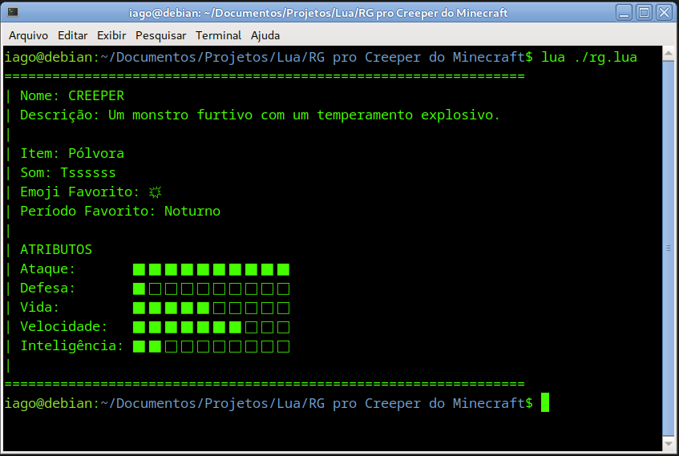

# Projeto RG do Monstro Creeper



Este é um projeto educacional desenvolvido para fins de aprendizado. O projeto consiste em uma representação do monstro Creeper do jogo Minecraft, incluindo suas características e atributos.

## Descrição

O Monstro Creeper é uma criatura furtiva com um temperamento explosivo, muito conhecida no jogo Minecraft. Esta representação do Creeper inclui várias informações sobre suas características, como nome, descrição, atributos e outros detalhes relevantes.

## Funcionalidades

- Visualização do nome e descrição do Monstro Creeper.
- Exibição de atributos como ataque, defesa, vida, velocidade e inteligência.
- Utilização de uma barra de progresso para representar visualmente os atributos.

## Tecnologias Utilizadas

- Linguagem de Programação: Lua

## Como Executar

1. Clone o repositório para o seu computador.
2. Certifique-se de ter o ambiente de desenvolvimento Lua configurado.
3. Execute o arquivo principal do projeto.

```lua
lua ./rg.lua
